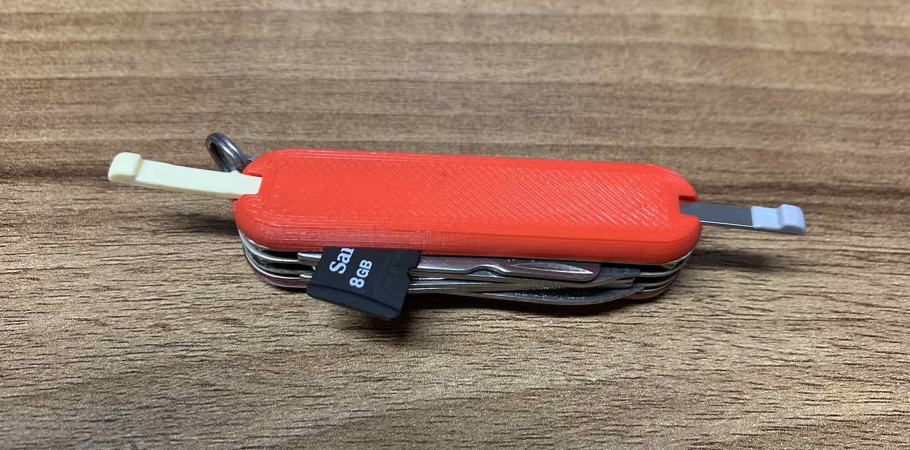
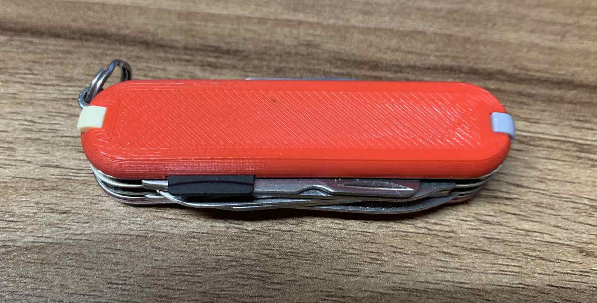
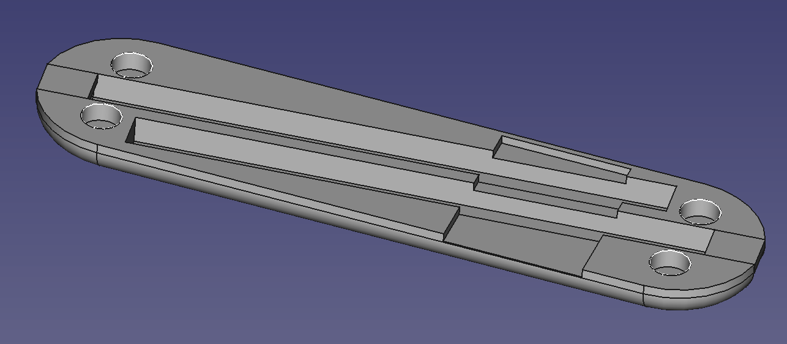

# Replacement scale for Victorinox 58mm swiss army knife

Since I upgraded from my Victorinox Rambler to a MiniChamp, I
couldn't use both the toothpick and the tweezers, as one scale
was replaced with the ballpoint pen.

I wanted to have both, so I replaced the scale with my own that
fits both, plus includes a slot for a MicroSD card.

Best printed rotated 180°, so that the outside of the scale points downwards.

_Created with FreeCAD 0.18._

 This work is licensed under a <a rel="license" href="http://creativecommons.org/licenses/by-sa/4.0/">Creative Commons Attribution-ShareAlike 4.0 International License</a>.